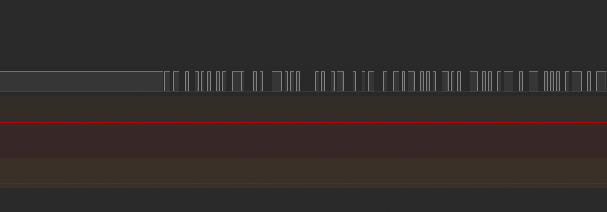

# LogicAnalyzer

This is an implementation of a Logic analyzer using the [SUMP](https://www.sump.org/projects/analyzer/protocol/) protocol.

## HARDWARE
Being tested on an ESP32 Wrover-E module

## Software

The code uses the Arduino library (for now) and can be uploaded using the arduino IDE. 

to recive the data over the seral port I am using [PulseView](https://sigrok.org/wiki/PulseView) the software has an 'OpenBench Logic Sniffer & SUMP compatibles (ols)' option.

### Examples
#### SETUP

#### This is an example of how I am testing the setup with a serial GPS module.

## Protocol

- [SUMP](https://www.sump.org/projects/analyzer/protocol/)

- [SUMP Extension](http://dangerousprototypes.com/docs/The_Logic_Sniffer%27s_extended_SUMP_protocol#Arm_.280x01.29)
